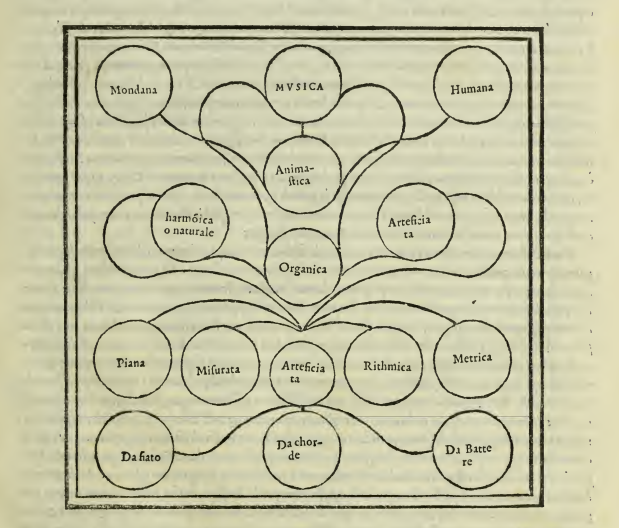

## CHAPTER FIVE: WHAT MUSIC IS IN GENERAL, AND OF ITS DIVISION

---

We will therefore make a beginning to such an honest and honorable study, seeing first what Music is, and then of how many sorts it is found, assigning to each sort its definition; and this we will do so as not to deviate from the good order that the ancients maintained, who wished that every discourse on whatever thing that is reasonably made should begin with the definition, so that one understands what one has to dispute about. Therefore, speaking in general, I say that Music is nothing other than Harmony; and we can say that it is that strife and friendship that Empedocles posited, from which he wished all things to be generated—that is, a discordant concord, as one would say, Concord of various things that can be joined together. But because this word Music has diverse significations, and reason requires that everything that carries many significations should first be divided before being defined (especially wishing to declare every part of it), therefore we will first divide it, saying: Music being of two sorts, Animastic and Organic.

One is harmony that is born from the composition of various things joined together in one body, although among themselves they are discrepant, such as is the mixture of the four Elements, or of other qualities in an animate body. The other is harmony that can be born from various instruments. And this we will again divide in two: for two sorts of instruments are found, that is, Natural and Artificial. The natural ones are those parts that concur in the formation of voices, such as the Throat, the Palate, the Tongue, the Lips, the Teeth, and finally the Lung, formed by nature. Which parts being moved by the Will, and from the movement of them being born sound, and from sound Speech, there is then born Modulation, or Singing: and thus by the movement of the body, by the reason of sound, and by the words accommodated to Song, perfect harmony is made, and there is born the Music called Harmonic or Natural.

The artificial instruments are human inventions and derive from Art, and form Artificial Music, which is that harmony that is born from similar instruments; and this is made in three modes: for it is born from instruments that render sound with natural breath, artificialized, such as Organs, Fifes, Trumpets, and similar; or from stringed instruments where breath is not needed, such as Harps, Lyres, Lutes, Harpsichords, Dulcimers, and similar, which are struck by fingers and quills, or are played with bows. Or finally from instruments to be beaten, such as Drums, Cymbals, Tabors, Bells, and other similar ones made of hollow wood and of skins of animals stretched over, and of metal, when they are struck by whatever thing one wishes.

So that the Artificial is found of three sorts: From breath, From strings, and From beating; and the Natural of four: Plain, Measured, Rhythmic, and Metric; although these four can also be attributed to the artificial, for the reasons we will say elsewhere. Of Animastic we will likewise make two parts, placing in the first the Mundane, and in the second the Human, as appears in the subjoined division.

*Here appears the diagram showing the divisions of MUSICA into Mondana (Mundane), Anima-stica (Animastic), and Humana (Human), with further subdivisions into harmónica o naturale (Harmonic or Natural) and Arteficia ta (Artificial), which then branches into Piana (Plain), Misurata (Measured), Arteficia ta (Artificial), Rithmica (Rhythmic), and Metrica (Metric), with the artificial further divided into Da fiato (From breath), Da chor-de (From strings), and Di Batte re (From beating)*

And although some have made a difference between the Music that is born from wind instruments, naming it Organic, from that which is born from strings and without breath, calling it Rhythmic, nevertheless I have wished to call one and the other indifferently Artificial. First, because it is not of much importance to name them more in one way than in another; and then to preserve the signification of the word Organ, whence comes this name Organic, which comprehends in general all sorts of artificial instruments; and beyond this to avoid equivocation: for saying Rhythmic, one could understand not only of that harmony that is born from artificial stringed instruments but also of that which results from well-composed Prose. But let us now see what each member of the above-demonstrated division is.

---